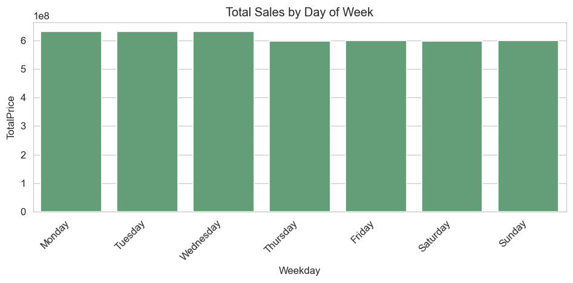
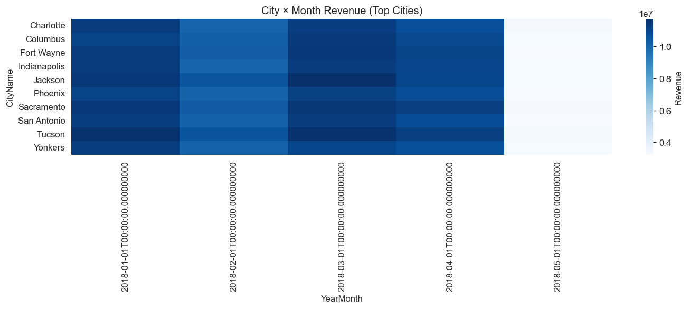

<!-- SECTION:TITLE -->
# Optimizing Retail Decisions through Customer Segmentation and Predictive Sales Modeling
<!-- /SECTION:TITLE -->

<!-- SECTION:EXEC_SUMMARY -->
This project is part of the Capstone for the **Professional Certificate in Data Analytics**.
It demonstrates how to design and implement a **data-driven pipeline** using a **synthetic but realistic grocery sales dataset**.

**Objective.** To illustrate how classical analytics techniques — data cleaning, exploratory analysis, customer segmentation (RFM + K-Means), and predictive modeling (Random Forest) — can be combined to support decision-making in a retail context.

**Scope.**
- The dataset is **synthetic** and used exclusively for educational purposes.
- Analysis replicates typical retail questions: *What are the key sales patterns? How can customers be segmented? How can future sales be forecasted?*
- The goal is not to recommend real-world actions, but to show how such methods would be applied on real data.

**Progress so far (NB01–NB05).**
- **NB01:** Data ingestion, cleaning, and validation across multiple tables (sales, customers, products, employees, geography).
- **NB02:** Exploratory analysis (KPIs such as ATV and UPT, Pareto concentration, RFM distributions).
- **NB03:** Construction of customer-level features (RFM + extras) and scaling for downstream K-Means clustering and forecasting.
- **NB04:** Customer segmentation via K-Means (RFM3 & Full), stability checks, harmonized labels.
- **NB05:** Random Forest forecasting (daily TotalRevenue), backtesting, holdout, intervals & feature importance.

> **Note.** This capstone emphasizes methodology and communication of results for a non-technical audience, not operational recommendations.
<!-- /SECTION:EXEC_SUMMARY -->

<!-- SECTION:INTRO -->
**Background & motivation.** Many retailers still rely on intuition for pricing, inventory, and promotions. We build a reproducible, data-driven pipeline on top of multi-table grocery sales data to inform **inventory**, **pricing**, and **CRM** decisions.

**Why data-driven now.** Rich historical transactions combined with dimensional data (products, customers, geography, staff) enable robust **descriptive analytics**, **customer segmentation (RFM + K-Means)**, and **predictive modeling (Random Forest)** to reduce stockouts/overstock, prioritize high-value customers, and target promotions.

**Scope.** This README doubles as the **Executive Report**. It is incrementally authored by the notebooks NB01–NB05 to keep analysis and communication in lockstep.
<!-- /SECTION:INTRO -->

<!-- SECTION:METHODS -->
### Data sources
- **Primary**: Grocery Sales multi-table CSVs (**sales**, **products**, **customers**, **employees**, **cities**, **countries**).
- **Secondary/Dimensional joins**: category/class attributes on products; city ↔ country mapping for customers and employees.

- **Guideline compliance**: ≥2 sources, ≥1,000 rows, ≥5 columns (met).

**Table availability (NB01 snapshot):**
  - sales: 6,758,125 rows
  - products: 452 rows
  - customers: 98,759 rows
  - employees: 23 rows
  - cities: 96 rows
  - countries: 206 rows

- **Sales date range (NB01)**: 2018-01-01 00:00:04.070000 → 2018-05-09 23:59:59.400000.

### Data cleaning & integration (NB01)
- Standardized types (dates, numeric, categorical) and normalized text (e.g., title-case for names/locations).
- Primary keys de-duplicated; categorical harmonization for product attributes.
- **Foreign-key validation** across sales→customers/products/employees and geography chains (customers/employees→cities→countries).
- Recomputed **UnitNetPrice** and **TotalPrice** from products × (1 - Discount) × Quantity; wrote `clean/sales_enriched.parquet`.
- Built a **daily sales calendar** with missing-day flags for later forecasting readiness.
- Generated **audit artifacts**: data dictionary, schema, summary, missingness/outlier plots, and MD5 hashes of official outputs.

**Foreign-key integrity (NB01 snapshot):**
- sales->customers: 0 missing keys
- sales->products: 0 missing keys
- sales->employees: 0 missing keys
- customers->cities: 0 missing keys
- employees->cities: 0 missing keys
- cities->countries: 0 missing keys

### Data provenance & reproducibility
- **Primary dataset**: Grocery Sales Dataset (Kaggle)
  Source: [https://www.kaggle.com/datasets/andrexibiza/grocery-sales-dataset/data](https://www.kaggle.com/datasets/andrexibiza/grocery-sales-dataset/data)

- **Custom preprocessing**: `products_with_category_v7_clean.csv`
  Created by merging and extending the original `products.csv` with `categories.csv`.
  New hierarchical categories were defined to achieve finer product granularity for downstream segmentation.

- **Reproducibility guarantees**
  - Random seed fixed at `42`.
  - Official audit artifacts stored under `clean/report/nb01/` (schemas, summaries, plots, hashes).
  - All cleaned outputs saved in `clean/*.parquet`.
  - README is automatically updated from notebooks via idempotent functions (`update_readme_section`).

> **Note.** The Grocery Sales Dataset is **synthetic but realistic**. Certain patterns (e.g., unusually low geographic concentration) reflect the synthetic generation process rather than true market structure.


### Feature engineering (NB03)

**Transaction definition & window.** We define a *transaction* at the **order** level (grouped by `SalesID`).
RFM metrics use the observed window **2018-01-01 00:00:00 → 2018-05-09 00:00:00** with the anchor date `t₀ = max(SalesDate with valid timestamp)`.
- **R (Recency)** = days since last purchase to `t₀`
- **F (Frequency)** = number of **orders** (not line items) in the window
- **M (Monetary)** = total net spend in the window

**Additional features (customer-level).**
We enrich RFM with interpretable attributes:
- `avg_ticket = Monetary / Frequency` (0 if `F=0`)
- `pct_discounted` = share of orders with ≥1 discounted item
- `n_categories` = distinct product categories purchased
- `top_city`, `top_country` (modes; **used for reporting only**, excluded from clustering due to weak separation)

**Scaling & reproducibility.**
All clustering features are **MinMax-scaled to [0,1]** with 0-imputation for missing values (seed `42`).
We persist scaler parameters for reproducibility:
```python
feature_order = ['recency_days', 'frequency', 'monetary', 'avg_ticket', 'pct_discounted', 'n_categories']
data_min_ = [0, 36, 1943.73, 37.31, 0.02, 7]
data_max_ = [21, 102, 126585.86, 1591.89, 0.44, 20]
```
**Data contracts & revenue reconciliation.**
- **DAILY** requires: `SalesDate` (no NaT), `TotalRevenue`, `observed` ∈ {0,1}
- **TRANSACTIONS** requires: `SalesID`, `SalesDate`, `CustomerID`, `ProductID`, `TotalPrice`, `Quantity`, `Discount`
- **Revenue reconciliation**: `sum(DAILY.TotalRevenue) == sum(TX.TotalPrice)` is enforced; contract violations abort official writes and save drafts under `clean/report/nb3/`.

**Published artifacts (NB03).**
- `clean/model_input/model_input_sales.parquet/csv` (daily series)
- `clean/model_input/model_input_sales_transactions.parquet` (+ sample CSV)
- `clean/model_input/model_input_customers.parquet/csv` (RFM + extras + scaled)
- `clean/model_input/model_features_customers_full.parquet/csv`
- `clean/model_input/model_features_customers_rfm3.parquet/csv`
- `clean/model_input/feature_catalog.json` (final feature lists, NaNs, bounds)
- `clean/model_input/model_input_metadata.json`, `clean/model_input/manifest.json`

**Time-series policy (consistency with NB02).**
Rows with missing `SalesDate` are **excluded** in time-based metrics and **included** in global KPIs. This policy ensures consistent aggregation for forecasting.
<!-- NB04_METHODS -->
**Customer Clustering (NB04)**
We apply **K-Means** on two feature variants (scaled in NB03, MinMax [0,1], `random_state=42`):

- **RFM3:** `recency_days_scaled`, `frequency_scaled`, `monetary_scaled`.
- **FULL:** RFM3 + `avg_ticket_scaled`, `pct_discounted_scaled`, `n_categories_scaled`.

**K selection.**
1) Quick scan on a ~20k sample for K ∈ [2..10] using **Silhouette**, **Davies–Bouldin**, **Calinski–Harabasz** and **Elbow** (inertia when available).
2) Stable confirmation on the full dataset with **high `n_init` (≈50)** around the best K (K*−1, K*, K*+1).
3) **Bootstrap stability** (30 runs, 80% subsamples): **agreement**, **ARI**, **NMI**. Acceptance rule: **Stable** if `median(agreement) ≥ 0.90` or `median(ARI) ≥ 0.80`.

**Label harmonization.**
K-Means indices are arbitrary. We define **High-Value** as the cluster maximizing `frequency + monetary - recency`, and build a standardized binary label **`hv01`**: `0=High-Value`, `1=Mid/Low-Value`. We also publish a **harmonized label** applying conservative guardrails (possible upgrades/downgrades if `frequency` and `monetary` cross thresholds).

**Variant consistency.**
We compare **FULL vs RFM3** via crosstab and **Agreement/ARI/NMI** (Hungarian alignment), and we drill down into disagreements for interpretability.

**Alternative models (benchmark).**
We report GMM (AIC/BIC), Agglomerative (Ward on a sample + nearest-centroid projection), and DBSCAN (eps grid) as a sanity check. The final choice remains **K-Means** for simplicity, reproducibility, and executive clarity.

**Artifacts (NB04).**
Scans → `clean/model_input/clusters/scan/*.csv`
Profiles & revenue → `clean/model_input/clusters/*profiles*.csv`, `.../revenue_profiles/revenue_by_cluster_full.csv`
Stability & consistency → `clean/model_input/clusters/validation/*`
Tableau feeds → `clean/model_input/clusters/tableau/*`
Alt models & master table → `clean/model_input/clusters/alt_models/*`, `.../validation/model_comparison_master.csv`

> Educational note: synthetic dataset; clusters are illustrative.
<!-- /NB04_METHODS -->
<!-- NB05_METHODS -->
**Predictive Modeling (NB05)**  
We train a supervised regressor to forecast **daily sales** using only **forward-computable features** (calendar, lags, rolling stats, Fourier weekly, and DOW one-hot). Segment-level transaction proxies are **excluded** to prevent leakage.

- **Model:** `RandomForestRegressor` (champion, tuned via CV)  
- **Target:** `TotalRevenue` (daily)  
- **Feature space (forward):** 39 variables  
- **Evaluation:** time-aware CV (blocked/rolling) + 14-day holdout  
- **Metrics:** RMSE, MAE, MAPE, WAPE, R² (exact values)  
- **Reproducibility:** fixed seeds; artifacts in `clean/forecast/*`

**Top features (importance snapshot, forward model)**  
| Feature | Permutation importance (mean) |
|---|---:|
| lag_4 | 0.043165 |
| fourier_wk_cos | 0.033898 |
| lag_28 | 0.018018 |
| fourier_wk_sin | 0.016538 |
| roll_std_3 | 0.008870 |
| dow_std_past | 0.006730 |
| dow_mean_past | 0.005154 |
| dow_1 | 0.004044 |
| day_of_week | 0.003847 |
| mean_gap_14_28 | 0.003532 |
<!-- /NB05_METHODS -->
<!-- /SECTION:METHODS -->

<!-- SECTION:RESULTS -->

## Results — Exploratory Data Analysis (NB02)

### Core KPIs
| Metric | Mean | Median | P90 |
|---|---:|---:|---:|
| **ATV (Average Transaction Value)** | 641.07 | 490.77 | 1,472.30 |
| **UPT (Units per Transaction)** | 13.00 | 13.00 | 23.00 |

> **Interpretation.** Medians sit below means, indicating long right tails (a few large baskets skew the average).

---

### Monthly Sales Trend


<sub>*Total Sales by Month.* Monthly total sales (rows with valid SalesDate only; policy excludes null dates).</sub>


> **Date policy.** Rows with missing `SalesDate` are **excluded** from time-series (but included in global KPIs). Excluded share: ~**1.0%**.


---

### Category Mix


<sub>*Top Categories by Revenue.* Top categories by revenue (bars sorted descending).</sub>


> The assortment is skewed: top categories contribute a disproportionate share of revenue, guiding assortment and promotional prioritization.

---

### RFM Distributions (for NB03–NB04)
| Feature | Median | P75 |
|---|---:|---:|
| **Recency (days)** | 1 | 2 |
| **Frequency (# transactions)** | 68 | 73 |
| **Monetary (total spend)** | 42,557 | 63,148 |


<sub>*RFM Correlation.* Correlation matrix for RFM features (Recency, Frequency, Monetary). Typical retail patterns: negative correlation between Recency and Frequency/Monetary (more recent buyers tend to buy more).</sub>


> **Pattern.** Recency is negatively correlated with Frequency/Monetary: more recent buyers tend to purchase more and spend more.

---

### Customer Concentration (Pareto)


<sub>*Pareto Curve — ~55.9% of customers drive 80% of revenue.* Pareto curve: share of customers vs share of revenue (red lines indicate the 80% threshold).</sub>


> **Key finding.** Approximately **55.9%** of customers generate **80%** of revenue — strong signal to pursue segmentation and targeted CRM.

---

### Geographic Concentration (executive snapshot)
- **HHI:** 0.01 → **Low** concentration *(Sanity check: unusually low geographic concentration — verify dimension joins)*
- **Top-5 cities (revenue share):** ~5.6%
- **Gini coefficient:** 0.02

> **Implication.** Geographic concentration highlights exposure to local shocks and clear hubs for targeted marketing/logistics.

---

### Executive Highlights (auto)
- **ATV ≈ 641.07**, **UPT ≈ 13.00** (ATV median ≈ 490.77).
- **Date policy:** ~**1.0%** rows excluded in time-series due to missing `SalesDate`.
- **Top category:** **Produce**; **Perishables:** ~**88.7%** of revenue.
- **Pareto:** ~**55.9%** of customers explain **80%** of sales.
- **Geography:** HHI = **0.01** (**Low**), Top-5 cities ≈ **5.6%** of revenue.

---
### Weekly Pattern (optional)


<sub>*Total Sales by Day of Week.* Total sales aggregated by weekday (valid dates only).</sub>


> Weekday aggregation supports staffing and promo scheduling (e.g., Fri/Sat peaks).
---
### Product Composition (optional)


<sub>*Products by Class.* Number of products by Class; helps explain assortment composition for executive stakeholders.</sub>


<sub>*Perishable vs Non-Perishable Products.* Count of products by Perishable flag (1=perishable, 0=non-perishable); informs inventory policy.</sub>


> Class and perishable composition inform inventory policy (shelf-life, markdown cadence) and margin management.
---
### City × Month Heatmap (optional)


<sub>*City × Month Revenue (Top Cities).* City × Month revenue heatmap (top revenue cities; valid dates only).</sub>


> Seasonal hotspots by city support local promotions and logistics planning.

<!-- Optional 2-column layout -->
<table>
  <tr>
    <td></td>
    <td></td>
  </tr>
</table>

---
<details>
<summary><b>Validation notes (auto)</b></summary>

- RFM distribution shows an unusual **Recency vs Frequency** balance. Double-check time cutoffs and transaction aggregation.
- Geographic concentration looks **unusually low** (HHI and Top-5). Re-validate city joins and filters.

</details>


## Results — Feature insights (NB03)

**Production-readiness snapshot.**
- Customers: **98,759** | Daily rows: **129** | Transactions: **6,690,599**
- Date window in daily series: **2018-01-01 00:00:00 → 2018-05-09 00:00:00**
- Published matrices: **full** (6 features), **RFM3** (3 features)

### Go/No-Go checklist
| Check | Pass |
|---|:--:|
| ≥ 1,000 customers | ✅ |
| ≥ 5 scaled features | ✅ |
| 1 row per CustomerID | ✅ |
| No NaNs in scaled features | ✅ |
| Scaled features in [0,1] | ✅ |
| RFM3 present | ✅ |

### Feature dictionary (summary)
| Feature | Type | Construction | Used in | Leakage risk | Included |
|---|---|---|---|---|:--:|
| `recency_days_scaled` | numeric [0,1] | days since last purchase to t₀ (MinMax) | Clustering (RFM3/full) | Low | ✓ |
| `frequency_scaled` | numeric [0,1] | #orders in window (MinMax) | Clustering (RFM3/full) | Low | ✓ |
| `monetary_scaled` | numeric [0,1] | net spend in window (MinMax) | Clustering (RFM3/full) | Low | ✓ |
| `avg_ticket_scaled` | numeric [0,1] | Monetary/Frequency (MinMax) | Clustering (full) | Low | ✓ |
| `pct_discounted_scaled` | numeric [0,1] | share of discounted orders (MinMax) | Clustering (full) | Low | ✓ |
| `n_categories_scaled` | numeric [0,1] | #distinct categories (MinMax) | Clustering (full) | Low | ✓ |

**NaN rates (scaled features):**
- `avg_ticket_scaled`: 0
- `frequency_scaled`: 0
- `monetary_scaled`: 0
- `n_categories_scaled`: 0
- `pct_discounted_scaled`: 0
- `recency_days_scaled`: 0

**Observed bounds (scaled features):**
- `avg_ticket_scaled`: min=0, max=1
- `frequency_scaled`: min=0, max=1
- `monetary_scaled`: min=0, max=1
- `n_categories_scaled`: min=0, max=1
- `pct_discounted_scaled`: min=0, max=1
- `recency_days_scaled`: min=0, max=1

> **Notes.**
> • Geographic mode features (`top_city`, `top_country`) are for reporting; they are **excluded from clustering** due to weak separation observed in EDA.
> • K-Means labels are arbitrary; NB04 will **harmonize** segment names (e.g., the cluster with highest average `monetary` becomes “High-Value”).

> **Reminder.** All results are illustrative for educational purposes using a synthetic dataset.
<!-- NB04_RESULTS -->
### Customer Segments (NB04)

**Selected K and quality**
- **FULL:** K = **2** | **Silhouette ≈ 0.3819** | **DB ≈ 1.0071** | **CH ≈ 87,885.7171**
- **RFM3:** K = **2** | **Silhouette ≈ 0.3968** | **DB ≈ 0.9761** | **CH ≈ 85,773.4636**

**Segment size & contribution (FULL, harmonized HV vs Mid/Low)**

| Segment | Share of customers | Share of revenue | Lift vs avg $/customer | F (median, scaled) | M (median, scaled) | R (median, scaled) |
|---|---|---|---|---|---|---|
| High-Value | 49.2% | 73.7% | +49.7% | 0.4848 | 0.4938 | 0.0476 |
| Mid/Low-Value | 50.8% | 26.3% | -48.1% | 0.4697 | 0.1641 | 0.0476 |

<sub>Source: `revenue_by_cluster_full.csv` (revenue share, lift) and `cluster_profiles_full_executive.csv` (R/F/M medians).</sub>

**Executive message.**
The **High-Value** segment concentrates a disproportionate share of revenue with a similar or smaller share of customers, driven by higher **Frequency** and **Monetary** and lower **Recency** (more active). Prioritize **retention**, **stockout prevention**, and **premium bundles/early access**. The **Mid/Low** group is a candidate for **activation and cross-sell** to raise purchase frequency and category breadth.

**Stability & consistency.**
- **Bootstrap (FULL, K=2)**: `median(agreement) ≈ 0.9994`, `median(ARI) ≈ 0.9974`, `median(NMI) ≈ 0.9929` → **STABLE**
- **Bootstrap (RFM3, K=2)**: `median(agreement) ≈ 0.9986`, `median(ARI) ≈ 0.9943`, `median(NMI) ≈ 0.9855`

> All results are educational using a synthetic dataset.
<!-- /NB04_RESULTS -->
<!-- NB05_RESULTS -->
### Forecasting Results (NB05)

**Cross-Validation (mean across folds)**  
| RMSE | MAE | MAPE | WAPE | R² |
|---:|---:|---:|---:|---:|
| 187973.59 | 158438.55 | n/a | n/a | -0.34 |

**Holdout (14 days)**  
| RMSE | MAE | MAPE | WAPE | R² | Uplift vs best sNaïve (%) |
|---:|---:|---:|---:|---:|---:|
| 199746.35 | 161236.64 | 48.22% | 0.48% | -0.11 | 33.55 |

> **Interpretation.** The Random Forest **improves RMSE versus seasonal naïve baselines**, both in cross-validation and in the 14-day holdout. The **slightly negative R²** indicates limited linear fit on the short window, but **operationally the model is useful** thanks to its uplift over sNaïve and the **calibrated 80% prediction intervals**.

**Prediction Intervals (calibrated @80%)**  
- Coverage (holdout): ~85.71%  
- Mean interval width: ~520187.57  
- Median interval width: ~496947.31


<sub>*Backtest, holdout, and 14-day future forecast from the champion Random Forest model.*</sub>
<!-- /NB05_RESULTS -->
<!-- /SECTION:RESULTS -->

<!-- SECTION:CONCLUSION -->
### Conclusion

**What we built.** A full, reproducible pipeline from raw multi-table data (NB01) to EDA (NB02), feature engineering and model inputs (NB03), customer segmentation with K-Means (NB04), and a daily sales forecaster with Random Forest (NB05). Artifacts and feeds are versioned in `clean/*`.

**Key takeaways (executive):**
- **Customer concentration:** ~55.9% of customers explain 80% of sales; segmentation is justified.
- **High-Value segment:** 49.2% of customers contribute 73.7% of revenue → focus on **retention** and **stockout prevention**.
- **Forecasting uplift:** RF improves RMSE vs. sNaïve (CV: 15.29%; Holdout: 33.55%).  
  - Even though the holdout R² is low/slightly negative, the **improvement over baseline** and the **80% PI coverage** make the model **operationally useful** (for 1–2 week inventory planning).

**Recommendations:**
1) **Inventory:** use forecast + PIs to set **min/max** levels for perishables; prioritize assortment for HV and top categories.  
2) **Promotions:** activate **Mid/Low** customers with bundles in adjacent categories; track weekly lift.  
3) **Pricing:** run A/B pilots of **dynamic markdowns** on overstock (wide PIs).  
4) **Modeling:** incorporate **exogenous signals** (holidays, weather), enrich with **aggregate past transaction signals** (no leakage), and benchmark **XGBoost**.  
5) **Metrics:** monitor **WAPE% and PI coverage** in production; raise alerts if drift > 10% vs. CV.

**Next steps (technical):**
- Automate **monthly retraining** with fixed backtesting and PI recalibration.  
- Publish **Tableau dashboards** using `clean/tableau_feeds/*` (timeline + KPIs + segments).  
- Maintain a live **Data Dictionary** (started in `clean/report/_handoff/data_dictionary.json`).

<sub>All results are educational on a synthetic dataset.</sub>
<!-- /SECTION:CONCLUSION -->
