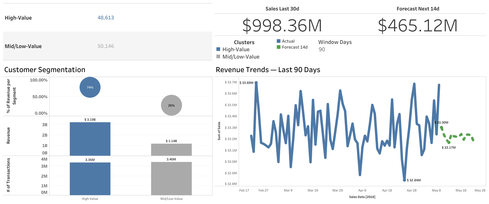

<!-- SECTION:TITLE -->
# Optimizing Retail Decisions through Customer Segmentation and Predictive Sales Modeling
<!-- /SECTION:TITLE -->

<!-- SECTION:EXEC_SUMMARY -->
**Author:** *Juan Diego Benavides*  
**Purpose:** Educational capstone — demonstrate a clear, end-to-end, **data-driven retail analytics** pipeline and communicate findings to non-technical stakeholders.

**Executive questions**
1) **What are the key sales patterns?**  
2) **Which customer segments drive revenue?**  
3) **How can short-term sales be forecast to inform inventory decisions?**

**What this project delivers**
- A coherent story, from raw data to insight: **Cleaning → EDA → Segmentation (RFM + K-Means) → Forecasting (Random Forest)**.  
- An **interactive Tableau dashboard** with an **Executive** view (KPIs, segments, 90-day trend & 14-day forecast) and an **EDA Explorer** view (filters by **Segment**, **Month-of-year**, **Weekday**).  
- This **README as Executive Report**, aligned to the capstone rubric.

**Key outcomes (high-level)**
- **Customer concentration:** ~**55.9%** of customers explain **80%** of revenue → segmentation is warranted.  
- **High-Value segment:** ~**49%** of customers contribute **~74%** of revenue → focus on **retention** and **stockout prevention**.  
- **Forecast uplift:** Random Forest beats a **seasonal naïve** baseline (≈**15%** CV uplift; **~34%** uplift on 14-day holdout), with calibrated **80% prediction interval** coverage.

> *Educational focus:* Results are illustrative on a **synthetic but realistic** dataset; the emphasis is on **methodology, reproducibility, and stakeholder communication**.
<!-- /SECTION:EXEC_SUMMARY -->

<!-- SECTION:INTRO -->
## Introduction

### Background & motivation
Retail teams often rely on intuition to set prices, allocate inventory, and plan promotions. With multi-table transactional data, **I** replace guesswork with **descriptive analytics**, **customer segmentation**, and **predictive modeling** that translate into fewer stockouts/overstocks and more targeted campaigns.

### Why this question (and why now)
- The dataset captures **who buys what, where, and when**, enabling both **customer-level** and **time-series** analysis.  
- RFM-based segmentation is **simple and actionable** for CRM teams.  
- Tree-based forecasting (Random Forest) provides **robust short-term predictions** without strong statistical assumptions.  
- Tableau makes insights **accessible** and **interactive** for non-technical audiences.

### Storyline
**I start** by making the data trustworthy (types, joins, integrity). **I then explore** patterns (KPIs, seasonality, category mix), **segment** customers with RFM + K-Means, and **forecast** near-term sales to support inventory planning. Finally, **I publish** an **Executive dashboard** to consume the insights interactively.

> This README doubles as the **Executive Report** and is incrementally authored by notebooks **NB01–NB05** to keep analysis and communication in lockstep.
<!-- /SECTION:INTRO -->

<!-- SECTION:METHODS -->
## Methods

### Data sources (≥2 sources, ≥1,000 rows, ≥5 columns — **met**)
- **Primary:** Grocery Sales multi-table CSVs — `sales`, `products`, `customers`, `employees`, `cities`, `countries`.  
- **Dimensional joins:** Product category/class attributes; city ↔ country mappings (customers & employees).
- **Derived (educational):** `products_with_category_v7_clean.csv` — I curated this file by joining the original `products` and `categories` tables and standardizing labels (merging synonyms, fixing typos, and consolidating classes). It improves category granularity but **may contain classification errors**, so treat it as a best-effort educational artifact rather than ground truth.

**NB01 snapshot (row counts & range)**  
- `sales`: **6,758,125** | `customers`: **98,759** | `products`: **452**  
- `employees`: **23** | `cities`: **96** | `countries`: **206**  
- Sales date range: **2018-01-01 00:00:04.070000 → 2018-05-09 23:59:59.400000**

### Data cleaning & integration (NB01)
- Standardized types (dates, numeric, categorical) and normalized text.  
- De-duplicated keys; harmonized product attributes.  

**Product taxonomy curation (disclaimer).** I created a derived mapping, `products_with_category_v7_clean.csv`, by joining `products` × `categories` and normalizing category/class labels. This improves consistency and analytical usefulness (e.g., Category Mix, class/perishable snapshots), but it is **best-effort** and **may include misclassifications**. All category-level insights should be interpreted with that limitation in mind.

- **Foreign-key validation** across sales→customers/products/employees and geography chains (customers/employees→cities→countries) — **0 missing keys** on each link.  
- Recomputed `UnitNetPrice` & `TotalPrice` from products × (1 − Discount) × Quantity.  
- Built a **daily sales calendar** (with missing-day flags).  
- Wrote clean artifacts under `clean/` (Parquet) and audits under `clean/report/`.

### Feature engineering (NB03)
**Transaction definition.** One **order** per `SalesID`. RFM window:  
**2018-01-01 00:00:00 → 2018-05-09 00:00:00**, anchor `t₀ = max(valid SalesDate)`.

- **R (Recency):** days since last purchase to `t₀`  
- **F (Frequency):** #orders (not line items)  
- **M (Monetary):** total net spend

**Additional features (customer-level).**  
`avg_ticket`, `pct_discounted` (share of orders with ≥1 discounted item), `n_categories`. Geography modes (`top_city`, `top_country`) are **reporting-only** (excluded from clustering).

**Scaling & reproducibility.**  
All clustering features **MinMax-scaled to [0,1]** with 0-imputation (`random_state=42`); scaler parameters persisted.

**Time-series policy (consistency with NB02).**  
Rows with missing `SalesDate` are **excluded** from time series but **included** in global KPIs.

### Customer clustering (NB04)
**I fit** **K-Means** on two variants (scaled in NB03):
- **RFM3:** `recency_days`, `frequency`, `monetary`  
- **FULL:** RFM3 + `avg_ticket`, `pct_discounted`, `n_categories`

**K selection workflow**  
1) Scan K∈[2..10] on a sample with **Silhouette**, **Davies–Bouldin**, **Calinski–Harabasz**, and **Elbow**.  
2) Confirm on full data with high `n_init` (≈50) around the best K.  
3) **Bootstrap stability** (30 runs, 80% subsamples): agreement/ARI/NMI.  
**Label harmonization:** **I define** **High-Value** as the cluster maximizing `frequency + monetary − recency`. **I publish** a binary `hv01` (0=High-Value, 1=Mid/Low).

### Forecasting (NB05)
**Target:** daily `TotalRevenue`. **Champion model:** `RandomForestRegressor`.  
**Forward-only features:** calendar, DOW one-hot, lags/rollings, weekly Fourier terms (no leakage; all use past only).  
**Validation:** time-aware CV (blocked/rolling) + **14-day holdout**.  
**Metrics:** RMSE, MAE, MAPE, WAPE, R²; **prediction intervals** calibrated to **80%** coverage.

### Reproducibility guarantees
- Random seed fixed (`42`) across modules.  
- Clean outputs in `clean/*.parquet`; model artifacts in `clean/forecast/*`.  
- README sections updated **idempotently** from notebooks.

### Data provenance & credits
- **Dataset:** *Grocery Sales Dataset* (synthetic but realistic).  
- **Original dataset author (credit):** **andrexibiza** — Kaggle.  
- Re-used/extended **for educational purposes only** (no real commercial recommendations).
<!-- /SECTION:METHODS -->

<!-- SECTION:RESULTS -->
## Results

> **Data lineage.** Unless noted otherwise, EDA visuals use **full history** from `sales_enriched.csv` **joined** with `customers_segments_tableau.csv` on `CustomerID`.  
> The **trend & forecast** use `ts_forecast_feed_long.csv` and are the **only** visuals affected by the **Window Days** parameter (30/60/90; default 90).

### 1) Exploratory Data Analysis (NB02)

#### Core KPIs (full history)
| Metric | Mean | Median | P90 |
|---|---:|---:|---:|
| **ATV (Average Transaction Value)** | 641.07 | 490.77 | 1,472.30 |
| **UPT (Units per Transaction)** | 13.00 | 13.00 | 23.00 |

Source: `sales_enriched.csv` (joined with `customers_segments_tableau.csv` for segment filters).

---

#### Monthly Sales Trend (illustrative)

Time series excludes rows with missing `SalesDate`. ~**1.0%** of rows were excluded from time series but **included** in global KPIs.  
Source: `sales_enriched.csv`.

---

#### Category Mix

Top categories concentrate revenue (assortment & promo focus). Source: `sales_enriched.csv`.  
**Note:** Category labels come from the curated mapping `products_with_category_v7_clean.csv` (educational; may include errors).

---

#### RFM Distributions (customer-level, NB03 input)
| Feature | Median | P75 |
|---|---:|---:|
| **Recency (days)** | 1 | 2 |
| **Frequency (# orders)** | 68 | 73 |
| **Monetary (total spend)** | 42,557 | 63,148 |

Recency negatively correlates with Frequency/Monetary (recent buyers purchase/spend more).  
Source: aggregated from `sales_enriched.csv` by `SalesID` (order-level).

---

#### Customer Concentration (Pareto)

~**55.9%** of customers generate **80%** of revenue → segmentation is warranted.  
Source: `sales_enriched.csv`.

---

#### Optional snapshots
 

Assortment & perishables composition — inventory & freshness policy. Source: product joins → `sales_enriched.csv`.  
**Note:** Category labels come from the curated mapping `products_with_category_v7_clean.csv` (educational; may include errors).

---

### 2) Feature insights (NB03)
**Production-readiness snapshot.**  
Customers: **98,759** | Daily rows: **129** | Transactions: **6,690,599**  
Published matrices: **full** (6 features) & **RFM3** (3 features). All scaled to **[0,1]** with **0 NaNs**.

Source: `clean/model_input/*.parquet` (summaries exported to CSV for the report).

---

### 3) Customer Segmentation (NB04)

**Selected K and quality**
- **FULL:** K = **2** | **Silhouette ≈ 0.3819** | **DB ≈ 1.0071** | **CH ≈ 87,885.7**  
- **RFM3:** K = **2** | **Silhouette ≈ 0.3968** | **DB ≈ 0.9761** | **CH ≈ 85,773.5**

**Segment size & contribution (FULL, harmonized HV vs Mid/Low)**

| Segment | Share of customers | Share of revenue | Lift vs avg $/customer |
|---|---:|---:|---:|
| High-Value | 49.2% | 73.7% | +49.7% |
| Mid/Low-Value | 50.8% | 26.3% | −48.1% |

Sources for the table: `cluster_profiles_full_executive.csv`, `revenue_by_cluster_full.csv`.  
Tableau uses `customers_segments_tableau.csv` for interactive filtering.

**Executive message.** The **High-Value** segment concentrates revenue with a similar share of customers, driven by higher **Frequency** and **Monetary** and lower **Recency** (more active). Prioritize **retention**, **stockout prevention**, and **premium bundles**. The **Mid/Low** group is a candidate for **activation** and **cross-sell** to raise purchase frequency and category breadth.

**Stability & consistency.** Bootstrap shows **very high agreement** (agreement/ARI/NMI ~0.99). **I benchmarked** alternative models (GMM, Agglomerative, DBSCAN) and **retained** **K-Means** for **simplicity** and **clarity**.

---

### 4) Forecasting (NB05)

**Cross-Validation (mean across folds)**  
| RMSE | MAE | MAPE | WAPE | R² |
|---:|---:|---:|---:|---:|
| 187,973.59 | 158,438.55 | n/a | n/a | −0.34 |

**Holdout (14 days)**  
| RMSE | MAE | MAPE | WAPE | R² | Uplift vs seasonal naïve |
|---:|---:|---:|---:|---:|---:|
| 199,746.35 | 161,236.64 | 48.22% | 0.48 | −0.11 | **+33.55%** |

Backtest, 14-day holdout, and 14-day future forecast from the champion RF model.  
Sources: `baseline_backtest_metrics_SAFE_7d_R.csv`, `champion_backtest_residuals.csv`,  
`rf_holdout_predictions_forward_CONF_ASYM_WEEKPART_SHRUNK_CALIB80.csv`,  
`rf_future_forecast_forward_CONF_ASYM_WEEKPART_SHRUNK_CALIB80.csv`.

**Prediction intervals (calibrated at 80%)**  
Holdout coverage ≈ **85.7%**; mean/median widths tracked in `pi_coverage_holdout.json`.

---

### 5) Dashboard (Tableau)

**Public link:** [Open the Tableau dashboard](https://public.tableau.com/views/DashboardRetailAnalytics/EDAExplorer?:language=en-US&:sid=&:redirect=auth&:display_count=n&:origin=viz_share_link)

**Executive** view
- **Trend & Forecast:** driven by `ts_forecast_feed_long.csv` (**affected by Window Days**). KPI cards (e.g., *Sales Last N days*, *Forecast Next 14 days*) are **Tableau calculated fields** over that feed.  
- **Segmentation cards, DOW pattern, Top Categories, Perishable mix, Discount buckets:** driven by **full-history** `sales_enriched.csv` joined to `customers_segments_tableau.csv` (these **do not** change with Window Days; they do respond to EDA filters where applicable).

**EDA Explorer** view
- **Filters:** **Segment**, **Month (month-of-year)**, **Weekday** — explore how KPIs and charts change by cohort and calendar slice.  
- **Key metrics:** Active Customers ~98,759; **ATV** ~641; **UPT** ~13 (full history).

  
  

> **Important:** Only the trend/forecast honors **Window Days**. All other Executive & EDA visuals aggregate **full history**.

<!-- /SECTION:RESULTS -->

<!-- SECTION:CONCLUSION -->
## Conclusion

### What I built
A reproducible pipeline from raw multi-table data (**NB01**) to **EDA** (**NB02**), **feature engineering** (**NB03**), **customer segmentation** (**NB04**), and a **short-term forecaster** (**NB05**). Artifacts live under `clean/*`; an interactive dashboard enables executive exploration.

### Executive takeaways
- **Concentration:** ~**55.9%** of customers drive **80%** of sales → segmentation is impactful.  
- **High-Value:** **~49%** of customers deliver **~74%** of revenue → prioritize retention & avoid stockouts.  
- **Forecast uplift:** RF beats seasonal naïve (CV ≈ **15%**, holdout ≈ **34%**) with **~86%** coverage for 80% PIs.

### Recommendations (education-first)
1) **Inventory:** set **min/max** using forecast + PIs, with special care for perishables and **High-Value** demand.  
2) **Promotions:** activate **Mid/Low** customers with adjacent-category bundles; monitor weekly lift.  
3) **Pricing:** pilot **dynamic markdowns** on overstock (wide PIs).  
4) **Modeling next:** add **exogenous signals** (holidays, weather), benchmark **XGBoost**, and keep **time-aware CV**.  
5) **Monitoring:** track **WAPE%** and **PI coverage**; alert if drift >10% vs CV.

### Authorship & data credits
- **Author:** *Juan Diego Benavides*.  
- **Dataset credit:** *Grocery Sales Dataset* by **andrexibiza** (Kaggle). Used & extended **for educational purposes**.

All results are educational on a synthetic dataset, intended to illustrate a robust analytics workflow and clear stakeholder communication.
<!-- /SECTION:CONCLUSION -->
