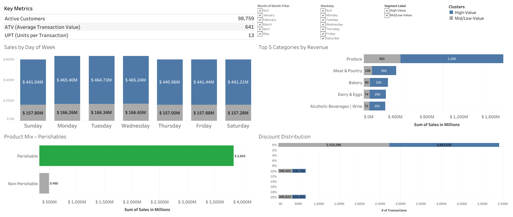

<!-- SECTION:TITLE -->
# Optimizing Retail Decisions through Customer Segmentation and Predictive Sales Modeling
<!-- /SECTION:TITLE -->

<!-- SECTION:EXEC_SUMMARY -->
**Author:** *Juan Diego Benavides*  
**Purpose:** Educational capstone demonstrating an end-to-end **data-driven retail analytics** pipeline and communicating findings to non-technical stakeholders.

**Executive questions**
1) **What are the key sales patterns?**  
2) **Which customer segments drive revenue?**  
3) **How can short-term sales be forecast to inform inventory decisions?**

**Deliverables**
- One coherent flow: **Cleaning → EDA → Segmentation (RFM + K-Means) → Forecasting (Random Forest)**.  
- An **interactive Tableau dashboard** with an **Executive** view (KPIs, segments, 90-day trend & 14-day forecast) and an **EDA Explorer** (filters by **Segment**, **Month-of-year**, **Weekday**).  
- This **README as Executive Report**, aligned with the capstone rubric.

**Headline results**
- **Customer concentration:** ~**55.9%** of customers explain **80%** of revenue → segmentation is warranted.  
- **High-Value segment:** ~**49%** of customers contribute **~74%** of revenue → retention and stockout prevention should be prioritized.  
- **Forecast uplift:** Random Forest improves over a **seasonal naïve** baseline (≈**15%** CV uplift; **~34%** on a 14-day holdout) with calibrated **80% prediction-interval** coverage.

> *Note:* The dataset is **synthetic but realistic**. The focus is on **methodology, reproducibility, and clear communication**.
<!-- /SECTION:EXEC_SUMMARY -->

<!-- SECTION:INTRO -->
## Introduction

Retailers often rely on intuition for pricing, inventory management, and promotions. With multi-table transactional data, guesswork can be replaced by **descriptive analytics**, **customer segmentation**, and **predictive modeling** to reduce stockouts/overstocks and target campaigns more effectively.

**Why this approach**
- The data captures **who buys what, where, and when**, enabling both **customer-level** and **time-series** analysis.  
- RFM-based segmentation is straightforward for CRM teams to act on.  
- Tree-based forecasting (Random Forest) offers robust short-term predictions without strict statistical assumptions.  
- Tableau translates the analysis into an **interactive** product for executives.

**How the story unfolds**
The pipeline first ensures trustworthy data (types, joins, integrity), then explores sales patterns (KPIs, seasonality, category mix), applies **RFM + K-Means** to segment customers, and builds a **short-term sales forecast** to support inventory planning. The results are published in an **Executive dashboard** for stakeholder exploration.
<!-- /SECTION:INTRO -->

<!-- SECTION:METHODS -->
## Methods

This section covers data sources, cleaning, features, models, validation, and reproducibility.

### Data sources (≥2 sources, ≥1,000 rows, ≥5 columns — **met**)
- **Primary:** Grocery Sales multi-table CSVs — `sales`, `products`, `customers`, `employees`, `cities`, `countries` (**Kaggle:** [Grocery Sales Dataset — andrexibiza](https://www.kaggle.com/datasets/andrexibiza/grocery-sales-dataset/data)).  
- **Dimensional joins:** Product category/class attributes; city ↔ country mappings (customers & employees).  
- **Derived (educational):** `products_with_category_v7_clean.csv` — curated by joining the original `products` and `categories` tables and standardizing labels (merging synonyms, fixing typos, consolidating classes). It improves category granularity but **may contain classification errors**, so it should be treated as a best-effort educational artifact.

**NB01 snapshot (row counts & range)**  
- `sales`: **6,758,125** | `customers`: **98,759** | `products`: **452**  
- `employees`: **23** | `cities`: **96** | `countries`: **206**  
- Sales date range: **2018-01-01 00:00:04.070000 → 2018-05-09 23:59:59.400000**

### Data cleaning & integration (NB01)
- Standardized types (dates, numeric, categorical) and normalized text.  
- De-duplicated keys; harmonized product attributes.  
- **Foreign-key validation** across sales→customers/products/employees and geography chains (customers/employees→cities→countries) — **0 missing keys**.  
- Recomputed `UnitNetPrice` & `TotalPrice` from products × (1 − Discount) × Quantity.  
- Built a **daily sales calendar** (with missing-day flags).  
- Produced clean artifacts under `clean/` (Parquet) and audits under `clean/report/`.

**Repository note — full vs mini feed**  
NB01 **materializes the full history** as `sales_enriched.csv`. Because that file is too large for GitHub, the repo ships a **size-capped** `sales_enriched_mini.csv`.  
> All KPIs and visuals in this README were computed on the **full** `sales_enriched.csv`. If only the mini feed is used, **minor discrepancies** may appear. To reproduce exact figures, run **NB01** locally to regenerate the full file.

### Feature engineering (NB03)
- **Transaction definition:** one **order** per `SalesID`. RFM window: **2018-01-01 → 2018-05-09**, anchor `t₀ = max(valid SalesDate)`.  
- **RFM:** `recency_days`, `frequency`, `monetary`.  
- **Extra customer features:** `avg_ticket`, `pct_discounted`, `n_categories`. Geography modes (`top_city`, `top_country`) are reporting-only.  
- **Scaling & reproducibility:** MinMax scaling to **[0,1]** with 0-imputation (`random_state=42`); scaler parameters persisted.  
- **Time-series policy:** rows with missing `SalesDate` are **excluded** from time series but **included** in global KPIs.

### Customer clustering (NB04)
K-Means fitted on two variants (from NB03):
- **RFM3:** `recency_days`, `frequency`, `monetary`  
- **FULL:** RFM3 + `avg_ticket`, `pct_discounted`, `n_categories`

**K selection**
1) Scan K∈[2..10] with **Silhouette**, **Davies–Bouldin**, **Calinski–Harabasz**, and **Elbow**.  
2) Confirm on full data with high `n_init` around the best K.  
3) **Bootstrap stability** (30 runs, 80% subsamples): agreement/ARI/NMI.  
**Labeling:** the **High-Value** cluster maximizes `frequency + monetary − recency`. A binary label `hv01` (0=High-Value, 1=Mid/Low) was also published.

### Forecasting (NB05)
- **Target:** daily `TotalRevenue`. **Champion:** `RandomForestRegressor`.  
- **Features (forward-only):** calendar, DOW one-hot, lags/rollings, weekly Fourier terms (no leakage).  
- **Validation:** time-aware CV (blocked/rolling) + **14-day holdout**.  
- **Metrics:** RMSE, MAE, **R²** for CV; **RMSE/MAE/MAPE/WAPE/R²** for holdout. **Prediction intervals** calibrated to **80%** coverage.

### Reproducibility
- Random seed fixed (`42`).  
- Clean outputs in `clean/*.parquet`; model artifacts in `clean/forecast/*`.  
- README sections updated **idempotently** from notebooks.

### Data provenance & credits
- **Dataset:** *Grocery Sales Dataset* by **andrexibiza** (Kaggle): <https://www.kaggle.com/datasets/andrexibiza/grocery-sales-dataset/data>  
- Re-used/extended **for educational purposes only**.
<!-- /SECTION:METHODS -->

<!-- SECTION:RESULTS -->
## Results

> **Data lineage.** EDA visuals were computed on **full history** from `sales_enriched.csv` joined with `customers_segments_tableau.csv`.  
> The **trend & forecast** use `clean/tableau_feeds/ts_forecast_feed_long.csv` and are the only visuals affected by the **Window Days** parameter (30/60/90; default 90).  
> **Repo note:** The repository includes `sales_enriched_mini.csv` due to size constraints; slight numeric differences may occur if only the mini feed is used.

### 1) Exploratory Data Analysis (NB02)

#### Core KPIs (full history)
| Metric | Mean | Median | P90 |
|---|---:|---:|---:|
| **ATV (Average Transaction Value)** | 641.07 | 490.77 | 1,472.30 |
| **UPT (Units per Transaction)** | 13.00 | 13.00 | 23.00 |

Source: `sales_enriched.csv` (joined with `customers_segments_tableau.csv` for segment filters).

---

#### Monthly Sales Trend (illustrative)

Rows with missing `SalesDate` are excluded from the time series (≈**1.0%**), but they remain in global KPIs. Source: `sales_enriched.csv`.

---

#### Category Mix

Revenue concentrates in a few categories (assortment & promo focus). Source: `sales_enriched.csv`.  
**Note:** Categories use the curated mapping `products_with_category_v7_clean.csv` (educational; may include errors).

---

#### RFM Distributions (customer-level, NB03 input)
| Feature | Median | P75 |
|---|---:|---:|
| **Recency (days)** | 1 | 2 |
| **Frequency (# orders)** | 68 | 73 |
| **Monetary (total spend)** | 42,557 | 63,148 |

Recency is negatively related to Frequency/Monetary (recent buyers purchase/spend more). Aggregated from `sales_enriched.csv` by `SalesID`.

---

#### Customer Concentration (Pareto)

~**55.9%** of customers generate **80%** of revenue → segmentation is warranted. Source: `sales_enriched.csv`.

---

#### Optional snapshots
 

Assortment and perishables composition — inventory & freshness policy. Source: product joins → `sales_enriched.csv`.  
**Note:** Category labels come from `products_with_category_v7_clean.csv` (educational; may include errors).

---

### 2) Feature insights (NB03)
Customers: **98,759** | Daily rows: **129** | Transactions: **6,690,599**.  
Published matrices: **FULL** (6 features) & **RFM3** (3 features). All scaled to **[0,1]** with **0 NaNs**.  
Source: `clean/model_input/*.parquet` (summaries exported to CSV for the report).

---

### 3) Customer Segmentation (NB04)

**Model quality**
- **FULL:** K = **2** | Silhouette ≈ **0.3819** | DB ≈ **1.0071** | CH ≈ **87,885.7**  
- **RFM3:** K = **2** | Silhouette ≈ **0.3968** | DB ≈ **0.9761** | CH ≈ **85,773.5**

**Segment size & contribution (FULL, harmonized HV vs Mid/Low)**

| Segment | Share of customers | Share of revenue | Lift vs avg $/customer |
|---|---:|---:|---:|
| High-Value | 49.2% | 73.7% | +49.7% |
| Mid/Low-Value | 50.8% | 26.3% | −48.1% |

Sources: `clean/tableau_feeds/cluster_profiles_full_executive.csv`, `clean/tableau_feeds/revenue_by_cluster_full.csv`. Tableau uses `customers_segments_tableau.csv` for interactive filtering.

**Interpretation.** The **High-Value** segment concentrates revenue with a similar share of customers, driven by higher Frequency/Monetary and lower Recency (more active). Priorities: **retention**, **stockout prevention**, **premium bundles**. The **Mid/Low** group is a candidate for **activation** and **cross-sell**.

**Stability.** Bootstrap agreement/ARI/NMI is ~0.99. GMM, Agglomerative, and DBSCAN were benchmarked; K-Means was retained for clarity and ease of use.

---

### 4) Forecasting (NB05)

**Cross-validation (mean across folds)**  
| RMSE | MAE | R² |
|---:|---:|---:|
| 187,973.59 | 158,438.55 | −0.34 |

*Note:* MAPE is unstable with zero/near-zero sales days, and WAPE per fold is less interpretable. CV focuses on **RMSE/MAE** and **R²**.  

**Holdout (14 days)**  
| RMSE | MAE | MAPE | WAPE | R² | Uplift vs seasonal naïve |
|---:|---:|---:|---:|---:|---:|
| 199,746.35 | 161,236.64 | **48.22%** | **48.0%** | −0.11 | **+33.55%** |

Backtest, 14-day holdout, and 14-day future forecast from the champion RF model.  
Sources: `clean/tableau_feeds/baseline_backtest_metrics_SAFE_7d_R.csv`, `clean/tableau_feeds/champion_backtest_residuals.csv`,  
`clean/tableau_feeds/rf_holdout_predictions_forward_CONF_ASYM_WEEKPART_SHRUNK_CALIB80.csv`,  
`clean/tableau_feeds/rf_future_forecast_forward_CONF_ASYM_WEEKPART_SHRUNK_CALIB80.csv`.

**Prediction intervals (80%)**  
Holdout coverage ≈ **85.7%**; mean/median widths tracked in `clean/tableau_feeds/pi_coverage_holdout.json`.

---

### 5) Dashboard (Tableau)

**Public link:** [Open the Tableau dashboard](https://public.tableau.com/views/DashboardRetailAnalytics/EDAExplorer?:language=en-US&:sid=&:redirect=auth&:display_count=n&:origin=viz_share_link)

**Executive** view
- **Trend & Forecast:** driven by `clean/tableau_feeds/ts_forecast_feed_long.csv` (**honors Window Days**). KPI cards (e.g., *Sales Last N days*, *Forecast Next 14 days*) are Tableau calculations over that feed.  
- **Segmentation cards, DOW pattern, Top Categories, Perishable mix, Discount buckets:** computed on **full-history** `sales_enriched.csv` joined to `customers_segments_tableau.csv` (these do **not** change with Window Days; they do respond to EDA filters).

**EDA Explorer** view
- **Filters:** **Segment**, **Month (month-of-year)**, **Weekday**.  
- **Reference metrics:** Active Customers ~98,759; **ATV** ~641; **UPT** ~13 (full history).

  
  

> Only the trend/forecast honors **Window Days**. The repo includes `sales_enriched_mini.csv` for convenience; the published dashboard and this report were computed on the **full** feed.
<!-- /SECTION:RESULTS -->

<!-- SECTION:CONCLUSION -->
## Conclusion

The project established a reproducible pipeline from raw multi-table data (**NB01**) through **EDA** (**NB02**), **feature engineering** (**NB03**), **customer segmentation** (**NB04**), and a **short-term forecaster** (**NB05**). Artifacts are stored under `clean/*`, and the dashboard enables interactive exploration of insights.

**Key takeaways**
- **Concentration:** ~**55.9%** of customers drive **80%** of sales → segmentation is essential.  
- **High-Value:** **~49%** of customers deliver **~74%** of revenue → retention and stockout prevention should be prioritized.  
- **Forecast uplift:** RF improves over seasonal naïve (CV ≈ **15%**, holdout ≈ **34%**) with **~86%** coverage for 80% PIs.

**Recommendations**
1) **Inventory:** set **min/max** with the forecast and PIs; prioritize perishables and **High-Value** demand.  
2) **Promotions:** activate **Mid/Low** customers with adjacent-category bundles; monitor weekly lift.  
3) **Pricing:** test **dynamic markdowns** on overstock (wide PIs).  
4) **Modeling next:** add **exogenous signals** (holidays, weather), benchmark **XGBoost**, keep **time-aware CV**.  
5) **Monitoring:** track **WAPE%** and **PI coverage**; flag drift >10% vs CV.

### Authorship & data credits
- **Author:** *Juan Diego Benavides*  
- **Dataset:** *Grocery Sales Dataset* — **andrexibiza** (Kaggle): <https://www.kaggle.com/datasets/andrexibiza/grocery-sales-dataset/data>  
- Used & extended **for educational purposes**.
<!-- /SECTION:CONCLUSION -->
